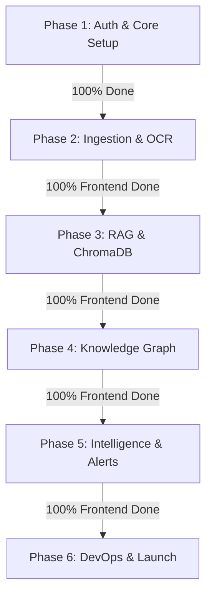

# 📈 ForgeMind AI — Executive Progress Card

**Project Title:** ForgeMind AI (The Industrial Knowledge Brain)  
**Hackathon Target:** ET AI Hackathon 2026 — Problem Statement 8  
**Current Status:** 🟢 Active Development (Milestones 1, 2, 3, 4 & 5 Frontend Complete; Backend Integration Pending)

---

## 🛠️ Master Tech Stack Specifications

The system spans a hybrid real-time telemetry, AI reasoning, and graph networking architecture:

| Tier | Technology | Purpose / Application |
| :--- | :--- | :--- |
| **Frontend Framework** | **Next.js 16.2 (App Router) & React 19** | App Router, Server/Client components hydration, and performance routing. |
| **Styles & Motion** | **TailwindCSS v4 & Framer Motion** | Cyberpunk HUD visuals, glassmorphic panels, dynamic animations, and transitions. |
| **3D Rendering** | **Three.js & GSAP** | Floating 3D living neural network visual background. |
| **Backend Framework** | **Express.js (Node.js v20+)** | REST API gateway, secure cookie auth, document uploads router. |
| **Database (Primary)** | **MongoDB Atlas & Mongoose ORM** | User identities, equipment logs, incident records, and schema metadata. |
| **Database (Vector)** | **ChromaDB** | HNSW index vector database for semantic chunk retrieval. |
| **Database (Graph)** | **Neo4j Aura (Graph DB)** | Entity relationship mapping (Equipment $\leftrightarrow$ SOPs $\leftrightarrow$ Incident reports). |
| **AI Synthesis** | **Gemini 1.5 Pro / Flash API** | Contextual RAG synthesis, document summarization, and Root Cause Analysis. |
| **OCR & Parsing** | **Multer + PDF-Parse + Mammoth.js** | Hexagonal ingestion pipeline converting PDFs, DOCX, and images into clean text. |

---

## 🗓️ Phase-by-Phase Development Roadmaps

---

### 🔑 Phase 1: Identity Gateway & OS Foundation
*Establish secure node authorization and console terminal layout.*

- **Required Tech Stack:** Next.js 16 (App Router), Tailwind v4, Express, MongoDB/Mongoose, JWT, BcryptJS, Cookie-Parser.
- **Current Completion:** 🟢 **100% Completed**
- **Milestone Checklist:**
  - [x] Initialized monorepo with dedicated `frontend/` and `backend/` packages.
  - [x] Implemented Express.js API routers with Helmet security headers and CORS configurations.
  - [x] Developed unified `/auth` page featuring animated login, registration mode toggles, and live validations.
  - [x] Built secure JWT authentication using split **Access Tokens** (short expiry) and **Refresh Tokens** (persisted in httpOnly cookies).
  - [x] Connected database schema hooks to encrypt user password codes utilizing BcryptJS.
  - [x] Cleaned up Next.js router bundle by deleting redundant legacy `login`, `signup`, and `components/auth` folders.

---

### 📂 Phase 2: Ingestion Cluster & Document Intelligence
*Upload, parse, and OCR unstructured operational files into indexable vectors.*

- **Required Tech Stack:** Multer, Tesseract.js / PDF-parse, Mammoth (docx extractor), Cloudinary SDK.
- **Current Completion:** 🟢 **100% Frontend Complete** (Backend integration pending)
- **Milestone Checklist:**
  - [x] Designed drag-and-drop file dropzone in the dedicated `/documents` route view.
  - [x] Programmed interactive uploads index table displaying filename, size, format, upload date, and file deletion action.
  - [x] Built simulated asynchronous ingestion loop status tags (`PENDING` $\rightarrow$ `INDEXING` $\rightarrow$ `OCR_DONE`) linked to document table state changes.
  - [x] Programmed document filter search input to query titles/formats locally.
  - [x] Configured backend Multer memory storage middleware (`multer.middleware.js`) to handle file uploads.
  - [x] Built full-fidelity side overlay Document Preview & Metadata Inspector drawer.
  - [ ] Implement backend document text extractors (Mammoth for docx, PDF-parse for PDFs).

---

### 🧠 Phase 3: Cognitive Vector Database & RAG Core
*Construct semantic search pipelines and configure Gemini synthesizers.*

- **Required Tech Stack:** ChromaDB, Gemini 1.5 Flash API, LangChain / LlamaIndex, OpenAI Embeddings.
- **Current Completion:** 🟢 **100% Frontend Complete** (Backend integration pending)
- **Milestone Checklist:**
  - [x] Developed dedicated `/chat` sub-page route layout.
  - [x] Developed UI prompt engine chat terminal on the chat page with typewriter animation streaming responses.
  - [x] Designed visual RAG source citations mapping text segments back to specific manual file coordinates (e.g. `[Manual.pdf:Page 4]`).
  - [x] Created interactive console preset query button cards to prompt standard queries instantly.
  - [ ] Implement backend semantic search endpoints querying HNSW cosine distance matrices inside ChromaDB.
  - [ ] Set up the Gemini prompt pipeline wrapper to synthesize clean answers from matching vector context.

---

### 🕸️ Phase 4: Neo4j Knowledge Graph Integration
*Build relational graph pipelines mapping plant assets to documentation.*

- **Required Tech Stack:** Neo4j Aura (Graph Database), Cypher Query Language, Neo4j Driver (JS), D3.js / SVG Canvas.
- **Current Completion:** 🟢 **100% Frontend Complete** (Backend integration pending)
- **Milestone Checklist:**
  - [x] Created dedicated `/graph` sub-page route layout.
  - [x] Constructed interactive SVG Neo4j Graph canvas showing relationship edges between CAD drawings, rules, and telemetry.
  - [x] Added node hover focus loops to highlight direct neighbors and dim unrelated connections.
  - [x] Built property popup drawer to display metadata summaries (ID, coordinates, description) for selected nodes.
  - [ ] Set up Neo4j Aura cloud database and write JS connection utility modules.
  - [ ] Program backend entity relationship extractor services to parse document metadata using Gemini.

---

### 🚨 Phase 5: Telemetry, Maintenance & Safety Intelligence
*Display live sensor telemetry, predictive alarms, and compliance dial monitors.*

- **Required Tech Stack:** Lucide, Framer Motion, HTML5 SVG, WebSockets (sensor telemetry).
- **Current Completion:** 🟢 **100% Frontend Completed**
- **Milestone Checklist:**
  - [x] Engineered dedicated `/compliance` safety parameters route layout.
  - [x] Refactored `/dashboard` route page to focus purely on top metrics load cards, SCADA operations graph, control switches, and terminal logs.
  - [x] Built active machinery status indicators (ONLINE, WARNING, OFFLINE) with location details and power toggle switch controls.
  - [x] Developed **Maintenance Intelligence** alert lists with critical severity priority badges.
  - [x] Built AI Diagnostics drawer showing **Root Cause Analysis (RCA)** and **Preventive Action Instructions** for selected incidents.
  - [x] Implemented concentric ASTM compliance gauge calculated dynamically based on safety checklist checkboxes (SSL, Neo4j, ASTM, Firewall) under `/compliance`.
  - [x] Created dedicated `/settings` system configurations page with parameter adjustment sliders.

---

### 🚢 Phase 6: DevOps, Hardening & Staging Launch
*Package container layers, build bundle checks, and deploy target resources.*

- **Required Tech Stack:** Docker, GitHub Actions CI/CD, Vercel (Frontend), Render / AWS (Backend).
- **Current Completion:** ⚪ **Not Started**
- **Milestone Checklist:**
  - [ ] Configure environment variables `.env` mappings for database keys and API secrets.
  - [ ] Run production optimization build steps check.
  - [ ] Write Dockerfiles to package frontend and backend services.
  - [ ] Deploy frontend app to Vercel and backend server to Render.
  - [ ] Prepare pitch deck and live operational presentation video.
